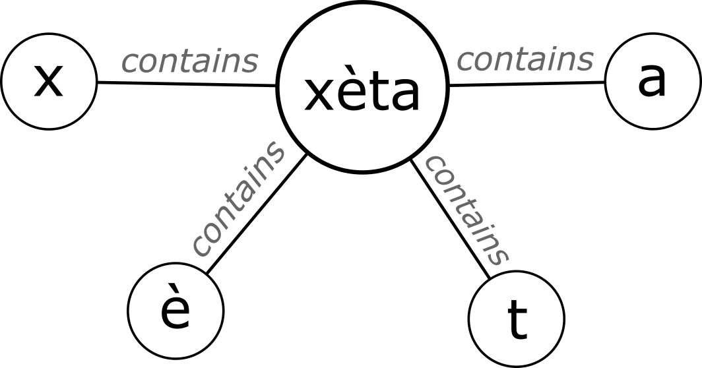

# NENA Text-Fabric Corpus

The NENA Text-Fabric (TF) corpus contains textual transcriptions and linguistic annotations from the research group under Geoffrey Khan at the University of Cambridge.

## Contents

* [Data Model](#Data-Model)
* [Node Types](#Node-Types)
* [Features](#Features)

## Data Model

For a full description of the Text-Fabric data model, see the [datamodel documentation](https://annotation.github.io/text-fabric/Model/Data-Model/).

One can think about the NENA Text-Fabric resource in two ways. The first is as a **conceptual** model, and the second is as a literal **implementation**. The conceptual model is simply a way of thinking about the text and all its various parts (words, sentences, letters, etc.). The literal implementation is the way that conceptual model is actually stored on a computer. 

The **conceptual** model of the TF NENA corpus is a graph. In mathematics, a [graph](https://en.wikipedia.org/wiki/Graph_theory) is a method of indicating relationships between entities. The entities in a graph are called "nodes", often illustrated visually as circles. Their relationships to one another are called "edges", illustrated with lines drawn between two or more circles. A visual representation can be seen below.


In the case of a [text graph](https://www.balisage.net/Proceedings/vol19/html/Dekker01/BalisageVol19-Dekker01.html), entities like letters, words, sentences are stored as nodes. These entities also have relationships. A key relationship in Text-Fabric is "containment": a sentence contains a word, a word contains a letter. Other, optional relationships might be syntactic relations or discourse relations between sentences. With the exception of "containment", the graph model of Text-Fabric does not "care" which other relationships are modeled (syntax, discourse, etc.). The user(s) are free to choose whatever relationships they are interested in.

For instance, in the example below we can see a containment relationship being modelled between a given word and its letter:




*To be continued...*

<hr>

# Node Types

| node type   |   frequency | features                                                                                                                                                                                                                                                                                                                                                             |
|:------------|------------:|:---------------------------------------------------------------------------------------------------------------------------------------------------------------------------------------------------------------------------------------------------------------------------------------------------------------------------------------------------------------------|
| dialect     |           2 | [dialect](#dialect)                                                                                                                                                                                                                                                                                                                                                  |
| text        |         126 | [informant](#informant), [text_id](#text_id), [place](#place), [continued_from](#continued_from), [source](#source), [version](#version), [title](#title)                                                                                                                                                                                                            |
| paragraph   |         351 | [number](#number)                                                                                                                                                                                                                                                                                                                                                    |
| line        |        2544 | [number](#number)                                                                                                                                                                                                                                                                                                                                                    |
| sentence    |       16707 |                                                                                                                                                                                                                                                                                                                                                                      |
| subsentence |       24527 |                                                                                                                                                                                                                                                                                                                                                                      |
| inton       |       35984 |                                                                                                                                                                                                                                                                                                                                                                      |
| word        |       93762 | [full_end](#full_end), [foreign](#foreign), [grm_desc](#grm_desc), [text_norm](#text_norm), [text](#text), [lang](#lang), [lite](#lite), [gloss](#gloss), [end](#end), [fuzzy_end](#fuzzy_end), [full](#full), [lite_end](#lite_end), [speaker](#speaker), [lemma](#lemma), [fuzzy](#fuzzy), [lemma_form](#lemma_form), [footnotes](#footnotes)                      |
| morpheme    |      120148 | [full_end](#full_end), [foreign](#foreign), [grm_desc](#grm_desc), [text_norm](#text_norm), [text](#text), [lang](#lang), [lite](#lite), [gloss](#gloss), [comment](#comment), [end](#end), [fuzzy_end](#fuzzy_end), [full](#full), [lite_end](#lite_end), [speaker](#speaker), [lemma](#lemma), [fuzzy](#fuzzy), [lemma_form](#lemma_form), [footnotes](#footnotes) |
| letter      |      539381 | [full_end](#full_end), [text](#text), [class](#class), [lite](#lite), [end](#end), [fuzzy_end](#fuzzy_end), [full](#full), [lite_end](#lite_end), [fuzzy](#fuzzy)                                                                                                                                                                                                    |

# Features

## dialect

name of a dialect in Northeastern Neo-Aramaic

**Node Counts**
| node type   |   frequency |
|:------------|------------:|
| dialect     |           2 |

**Values**
| dialect   |   frequency |
|:----------|------------:|
| Barwar    |           1 |
| Urmi_C    |           1 |

[back to node types](#Node-Types)
<hr>

## title

title of a text (story)

**Node Counts**
| node type   |   frequency |
|:------------|------------:|
| text        |         126 |

**Values**
| title                                         | dialect   |
|:----------------------------------------------|:----------|
| A Hundred Gold Coins                          | Barwar    |
| A Man Called Čuxo                             | Barwar    |
| A Tale of Two Kings                           | Barwar    |
| A Tale of a Prince and a Princess             | Barwar    |
| Baby Leliθa                                   | Barwar    |
| Dəmdəma                                       | Barwar    |
| Gozali and Nozali                             | Barwar    |
| I Am Worth the Same as a Blind Wolf           | Barwar    |
| Man Is Treacherous                            | Barwar    |
| Measure for Measure                           | Barwar    |
| Nanno and Jəndo                               | Barwar    |
| Qaṭina Rescues His Nephew From Leliθa         | Barwar    |
| Sour Grapes                                   | Barwar    |
| Tales From the 1001 Nights                    | Barwar    |
| The Battle With Yuwanəs the Armenian          | Barwar    |
| The Bear and the Fox                          | Barwar    |
| The Brother of Giants                         | Barwar    |
| The Cat and the Mice                          | Barwar    |
| The Cooking Pot                               | Barwar    |
| The Crafty Hireling                           | Barwar    |
| The Crow and the Cheese                       | Barwar    |
| The Daughter of the King                      | Barwar    |
| The Fox and the Lion                          | Barwar    |
| The Fox and the Miller                        | Barwar    |
| The Fox and the Stork                         | Barwar    |
| The Giant’s Cave                              | Barwar    |
| The Girl and the Seven Brothers               | Barwar    |
| The King With Forty Sons                      | Barwar    |
| The Leliθa From č̭āl                           | Barwar    |
| The Lion King                                 | Barwar    |
| The Lion With a Swollen Leg                   | Barwar    |
| The Man Who Cried Wolf                        | Barwar    |
| The Man Who Wanted to Work                    | Barwar    |
| The Monk Who Wanted to Know When He Would Die | Barwar    |
| The Monk and the Angel                        | Barwar    |
| The Priest and the Mullah                     | Barwar    |
| The Sale of an Ox                             | Barwar    |
| The Scorpion and the Snake                    | Barwar    |
| The Selfish Neighbour                         | Barwar    |
| The Sisisambər Plant                          | Barwar    |
| The Story With No End                         | Barwar    |
| The Tale of Farxo and Səttiya                 | Barwar    |
| The Tale of Mămo and Zine                     | Barwar    |
| The Tale of Mərza Pămət                       | Barwar    |
| The Tale of Nasimo                            | Barwar    |
| The Tale of Parizada, Warda and Nargis        | Barwar    |
| The Tale of Rustam (1)                        | Barwar    |
| The Tale of Rustam (2)                        | Barwar    |
| The Wise Daughter of the King                 | Barwar    |
| The Wise Snake                                | Barwar    |
| The Wise Young Man                            | Barwar    |
| šošət Xere                                    | Barwar    |
| A Close Shave                                 | Urmi_C    |
| A Cure for a Husband’s Madness                | Urmi_C    |
| A Donkey Knows Best                           | Urmi_C    |
| A Dragon in the Well                          | Urmi_C    |
| A Dutiful Son                                 | Urmi_C    |
| A Frog Wants a Husband                        | Urmi_C    |
| A Lost Donkey                                 | Urmi_C    |
| A Lost Ring                                   | Urmi_C    |
| A Painting of the King of Iran                | Urmi_C    |
| A Pound of Flesh                              | Urmi_C    |
| A Sweater to Pay Off a Debt                   | Urmi_C    |
| A Thousand Dinars                             | Urmi_C    |
| A Visit From Harun Ar-Rashid                  | Urmi_C    |
| Agriculture and Village Life                  | Urmi_C    |
| Am I Dead?                                    | Urmi_C    |
| An Orphan Duckling                            | Urmi_C    |
| Axiqar                                        | Urmi_C    |
| Events in 1946 on the Urmi Plain              | Urmi_C    |
| Games                                         | Urmi_C    |
| Hunting                                       | Urmi_C    |
| I Have Died                                   | Urmi_C    |
| Ice for Dinner                                | Urmi_C    |
| Is There a Man With No Worries?               | Urmi_C    |
| Kindness to a Donkey                          | Urmi_C    |
| Lost Money                                    | Urmi_C    |
| Mistaken Identity                             | Urmi_C    |
| Much Ado About Nothing                        | Urmi_C    |
| Nipuxta                                       | Urmi_C    |
| No Bread Today                                | Urmi_C    |
| Problems Lighting a Fire                      | Urmi_C    |
| St. Zayya’s Cake Dough                        | Urmi_C    |
| Star-Crossed Lovers                           | Urmi_C    |
| Stomach Trouble                               | Urmi_C    |
| The Adventures of Ashur                       | Urmi_C    |
| The Adventures of Two Brothers                | Urmi_C    |
| The Adventures of a Princess                  | Urmi_C    |
| The Angel of Death                            | Urmi_C    |
| The Assyrians of Armenia                      | Urmi_C    |
| The Assyrians of Urmi                         | Urmi_C    |
| The Bald Child and the Monsters               | Urmi_C    |
| The Bald Man and the King                     | Urmi_C    |
| The Bird and the Fox                          | Urmi_C    |
| The Cat’s Dinner                              | Urmi_C    |
| The Cow and the Poor Girl                     | Urmi_C    |
| The Dead Rise and Return                      | Urmi_C    |
| The Fisherman and the Princess                | Urmi_C    |
| The Giant One-Eyed Demon                      | Urmi_C    |
| The Little Prince and the Snake               | Urmi_C    |
| The Loan of a Cooking Pot                     | Urmi_C    |
| The Man Who Wanted to Complain to God         | Urmi_C    |
| The Old Man and the Fish                      | Urmi_C    |
| The Purchase of a Donkey                      | Urmi_C    |
| The Snake’s Dilemma                           | Urmi_C    |
| The Stupid Carpenter                          | Urmi_C    |
| The Wife Who Learns How to Work               | Urmi_C    |
| The Wife Who Learns How to Work (2)           | Urmi_C    |
| The Wife’s Condition                          | Urmi_C    |
| The Wise Brother                              | Urmi_C    |
| The Wise Young Daughter                       | Urmi_C    |
| Trickster                                     | Urmi_C    |
| Two Birds Fall in Love                        | Urmi_C    |
| Two Wicked Daughters-In-Law                   | Urmi_C    |
| Village Life                                  | Urmi_C    |
| Village Life (2)                              | Urmi_C    |
| Village Life (3)                              | Urmi_C    |
| Village Life (4)                              | Urmi_C    |
| Village Life (5)                              | Urmi_C    |
| Village Life (6)                              | Urmi_C    |
| Vineyards                                     | Urmi_C    |
| Weddings                                      | Urmi_C    |
| Weddings and Festivals                        | Urmi_C    |
| When Shall I Die?                             | Urmi_C    |
| Women Are Stronger Than Men                   | Urmi_C    |
| Women Do Things Best                          | Urmi_C    |

[back to node types](#Node-Types)
<hr>

## version

version of the story if there are multiple instances of the same story

**Node Counts**
| node type   |   frequency |
|:------------|------------:|
| text        |           2 |

**Values**
| version   |   frequency |
|:----------|------------:|
| Version 1 |           1 |
| Version 2 |           1 |

[back to node types](#Node-Types)
<hr>

## number

sequential number of a paragraph or line within a text or paragraph, respectively

**Node Counts**
| node type   |   frequency |
|:------------|------------:|
| paragraph   |         351 |
| line        |        2544 |

**Examples**
```
1
2
3
4
5
```

[back to node types](#Node-Types)
<hr>

## text

plain text representation of a letter, morpheme, or word

**Node Counts**
| node type   |   frequency |
|:------------|------------:|
| word        |       93762 |
| morpheme    |      120148 |
| letter      |      539381 |


See the [transcription tables](transcription.md).

[back to node types](#Node-Types)
<hr>

## text_norm

plain text without accents

**Node Counts**
| node type   |   frequency |
|:------------|------------:|
| word        |       93762 |
| morpheme    |      120148 |


See the [transcription tables](transcription.md).

[back to node types](#Node-Types)
<hr>

## full

full transcription, one-to-one transcription of a letter, morpheme, or word

**Node Counts**
| node type   |   frequency |
|:------------|------------:|
| word        |       93762 |
| morpheme    |      120148 |
| letter      |      539381 |


See the [transcription tables](transcription.md).

[back to node types](#Node-Types)
<hr>

## lite

lite transcription of a letter, morpheme, or word, without vowel accents

**Node Counts**
| node type   |   frequency |
|:------------|------------:|
| word        |       93762 |
| morpheme    |      120148 |
| letter      |      539381 |


See the [transcription tables](transcription.md).

[back to node types](#Node-Types)
<hr>

## fuzzy

fuzzy transcription that leaves out most diacritics and maps certain characters in certain dialects to common characters

**Node Counts**
| node type   |   frequency |
|:------------|------------:|
| word        |       93762 |
| morpheme    |      120148 |
| letter      |      539381 |


See the [transcription tables](transcription.md).

[back to node types](#Node-Types)
<hr>

## end

space, punctuation, or other stylistic text at the end of a morpheme or word

**Node Counts**
| node type   |   frequency |
|:------------|------------:|
| word        |       93762 |
| morpheme    |      120148 |
| letter      |      539381 |


See the [transcription tables](transcription.md).

[back to node types](#Node-Types)
<hr>

## full_end

full transcription of punctuation or other stylistic text at the end of a morpheme or word; see also trans_f

**Node Counts**
| node type   |   frequency |
|:------------|------------:|
| word        |       93762 |
| morpheme    |      120148 |
| letter      |      539381 |


See the [transcription tables](transcription.md).

[back to node types](#Node-Types)
<hr>

## lite_end

lite transcription of punctuation or other stylistic text at the end of a morpheme or word, excluding intonation boundary markers; see also trans_l

**Node Counts**
| node type   |   frequency |
|:------------|------------:|
| word        |       93762 |
| morpheme    |      120148 |
| letter      |      539381 |


See the [transcription tables](transcription.md).

[back to node types](#Node-Types)
<hr>

## fuzzy_end

fuzzy transcription of punctuation or other stylistic text at the end of a morpheme or word, excluding intonation boundary markers; see also trans_l

**Node Counts**
| node type   |   frequency |
|:------------|------------:|
| word        |       93762 |
| morpheme    |      120148 |
| letter      |      539381 |


See the [transcription tables](transcription.md).

[back to node types](#Node-Types)
<hr>

## speaker

name or initials of person speaking a morpheme or word; see also informant

**Node Counts**
| node type   |   frequency |
|:------------|------------:|
| word        |       93762 |
| morpheme    |      120148 |

**Examples**
```
Dawið ʾAdam
Yulia Davudi
Yuwarəš Xošăba Kena
Manya Givoyev
Yuwəl Yuḥanna
```

[back to node types](#Node-Types)
<hr>

## footnotes

explanatory footnote on a morpheme or text

**Node Counts**
| node type   |   frequency |
|:------------|------------:|
| word        |           3 |
| morpheme    |           3 |

**Examples**
```
[^1]: None
[^1]: The name Čuxo means ‘one who wears the woolen *čuxa* garment’.
[^2]: None
```

[back to node types](#Node-Types)
<hr>

## lang

language of a morpheme foreign to a text

**Node Counts**
| node type   |   frequency |
|:------------|------------:|
| word        |         436 |
| morpheme    |         462 |

**Values**
| lang   |   frequency |
|:-------|------------:|
| R      |         314 |
| P      |         260 |
| E      |         160 |
| Az     |         116 |
| Arm    |          38 |
| Ge     |           6 |
| F      |           4 |

[back to node types](#Node-Types)
<hr>

## foreign

indicates whether a morpheme is foreign to a text; see also lang

**Node Counts**
| node type   |   frequency |
|:------------|------------:|
| word        |         507 |
| morpheme    |         534 |

**Values**
| foreign   |   frequency |
|:----------|------------:|
| True      |        1041 |

[back to node types](#Node-Types)
<hr>

## comment

explanatory comment inserted in the text, stored on a morpheme

**Node Counts**
| node type   |   frequency |
|:------------|------------:|
| morpheme    |           1 |

**Examples**
```
*interruption*
```

[back to node types](#Node-Types)
<hr>

## continued_from

text is a follow-up to the named text

**Node Counts**
| node type   |   frequency |
|:------------|------------:|
| text        |           1 |

**Examples**
```
The Wife Who Learns How to Work
```

[back to node types](#Node-Types)
<hr>

## informant

name of person who spoke these words

**Node Counts**
| node type   |   frequency |
|:------------|------------:|
| text        |         126 |

**Values**
| informant           |   frequency |
|:--------------------|------------:|
| Yulia Davudi        |          37 |
| Dawið ʾAdam         |          14 |
| Yuwəl Yuḥanna       |           7 |
| Maryam Gwirgis      |           6 |
| Yuwarəš Xošăba Kena |           6 |
| Awiko Sulaqa        |           5 |
| Xošebo ʾOdišo       |           5 |
| Bənyamən Bənyamən   |           4 |
| Manya Givoyev       |           4 |
| Gwərgəs Dawið       |           3 |
| Nadia Aloverdova    |           3 |
| Nancy George        |           3 |
| Natan Khoshaba      |           3 |
| Victor Orshan       |           3 |
| Yosəp bet Yosəp     |           3 |
| Alice Bet-Yosəp     |           2 |
| Arsen Mikhaylov     |           2 |
| Frederic Ayyubkhan  |           2 |
| Sophia Danielova    |           2 |
| Yonan Petrus        |           2 |
| Blandina Barwari    |           1 |
| Dawid Adam          |           1 |
| Dawið Gwərgəs       |           1 |
| Jacob Petrus        |           1 |
| Kena Kena           |           1 |
| Leya ʾOraha         |           1 |
| Merab Badalov       |           1 |
| Mišayel Barčəm      |           1 |
| Nanəs Bənyamən      |           1 |
| Nawiya ʾOdišo       |           1 |

[back to node types](#Node-Types)
<hr>

## place

place a text was recorded

**Node Counts**
| node type   |   frequency |
|:------------|------------:|
| text        |         126 |

**Values**
| place                  |   frequency |
|:-----------------------|------------:|
| +Hassar +Baba-čanɟa, N |          36 |
| Dure                   |          31 |
| ʾƐn-Nune               |          20 |
| Zumallan, N            |          11 |
| Canda, Georgia         |           7 |
| Guylasar, Armenia      |           7 |
| Arzni, Armenia         |           4 |
| Babari, S              |           3 |
| +Hassar +Baba-canɟa, N |           1 |
| +Spurġān, N            |           1 |
| Gulpashan, S           |           1 |
| Mushava, N             |           1 |
| Mushawa, N             |           1 |
| Spurġān, N             |           1 |
| Ɛn Nune                |           1 |

[back to node types](#Node-Types)
<hr>

## source

name of the file from which a text was converted

**Node Counts**
| node type   |   frequency |
|:------------|------------:|
| text        |         126 |

**Examples**
```
cu vol 4 texts.html
bar text a1-A7.html
bar text A9-A13.html
bar text a19-A23.html
bar text A37-A40.html
```

[back to node types](#Node-Types)
<hr>

## text_id

id of a text within its original publication; can overlap between publications

**Node Counts**
| node type   |   frequency |
|:------------|------------:|
| text        |         125 |

**Examples**
```
A10
A11
A12
A13
A14
```

[back to node types](#Node-Types)
<hr>

## class

class of a letter (consonant or vowel)

**Node Counts**
| node type   |   frequency |
|:------------|------------:|
| letter      |      539381 |

**Values**
| class     |   frequency |
|:----------|------------:|
| consonant |      311071 |
| vowel     |      228310 |

[back to node types](#Node-Types)
<hr>

## lemma

lemma of a word

**Node Counts**
| node type   |   frequency |
|:------------|------------:|
| word        |       22815 |
| morpheme    |       28963 |

**Examples**
```
w, ʾu-
ṱ
xa, xaʾa
b-
la
```

[back to node types](#Node-Types)
<hr>

## lemma_form

grammatical form of a word lemma

**Node Counts**
| node type   |   frequency |
|:------------|------------:|
| word        |        2263 |
| morpheme    |        2276 |

**Examples**
```
pl.
f.
abs.
sing.
f. and pl.
```

[back to node types](#Node-Types)
<hr>

## grm_desc

grammatical description of a word lemma

**Node Counts**
| node type   |   frequency |
|:------------|------------:|
| word        |       20836 |
| morpheme    |       28963 |

**Values**
| grm_desc                  |   frequency |
|:--------------------------|------------:|
| n.m.                      |        9306 |
| part.                     |        7863 |
| prep.                     |        5517 |
| n.f.                      |        5319 |
|                           |        2934 |
| num.                      |        2495 |
| adj.                      |        1662 |
| adv.                      |        1561 |
| mod.                      |        1504 |
| pron. cs.                 |        1392 |
| pron. ms.                 |        1100 |
| part. pron.               |         849 |
| n.m. prep.                |         815 |
| pron. pl.                 |         798 |
| pron. fs.                 |         694 |
| n.m. num.                 |         480 |
| n.f. prep.                |         410 |
| n.m. part.                |         398 |
| n.f. num.                 |         298 |
| part., prep.              |         244 |
| adj. invar.               |         220 |
| n.pl.tan.                 |         213 |
| mod. adv.                 |         212 |
| n.f. part.                |         210 |
| adj. adv. mod.            |         192 |
| n.pl.                     |         174 |
| n.m. pron. ms.            |         159 |
| m.                        |         143 |
| n.m./adj.                 |         140 |
| n.m./f.                   |         136 |
| num. part.                |         134 |
| pron. cs. part.           |         115 |
| interj.                   |         113 |
| pron.                     |         104 |
| adv. prep.                |          98 |
| prep. part.               |          87 |
| part. pron. fs.           |          76 |
| n.m. mod.                 |          60 |
| n.f. pron. fs.            |          57 |
| adv. part.                |          56 |
| prep. num.                |          54 |
| prep. pron.               |          53 |
| adj. part.                |          48 |
| n.f./m.                   |          46 |
| mod. part.                |          45 |
| n.f                       |          45 |
| pron. pl. part.           |          45 |
| n.f. num. prep.           |          42 |
| n.m. prep. num.           |          39 |
| pron. pl. n.m.            |          37 |
| part. pron. prep.         |          36 |
| n.m                       |          32 |
| n.m. n.f.                 |          32 |
| pron. mod.                |          32 |
| n.m. num. part.           |          30 |
| n.m./f. prep.             |          30 |
| m.n.                      |          29 |
| n.m. adv./adj.            |          28 |
| n.m. prep. part.          |          28 |
| num. mod.                 |          28 |
| adj. pron. ms.            |          26 |
| n.pl.tant.                |          24 |
| n.f. mod.                 |          20 |
| n.f. part. num.           |          20 |
| adj. cs.                  |          16 |
| prep. adj.                |          16 |
| prep. mod.                |          16 |
| n.f. part. prep.          |          15 |
| n.f./adj.f                |          14 |
| n.m. adj.                 |          14 |
| n.pl.tan. prep.           |          14 |
| part. pron. ms.           |          14 |
| pron. ms. part.           |          14 |
| part. pron. part.         |          12 |
| prep. n.pl.               |          12 |
| pron. pl. num.            |          12 |
| m. num.                   |          11 |
| n.m.,                     |          11 |
| n.pl. part.               |          11 |
| num. adj. adv. mod.       |          11 |
| num. prep.                |          10 |
| pron. ms. adj. adv. mod.  |          10 |
| adj. pron. fs.            |           9 |
| cst.                      |           9 |
| n.m. n.f. part.           |           9 |
| n.m..                     |           9 |
| n.m./f. num.              |           9 |
| num. pron. ms.            |           9 |
| prep. pron. ms.           |           9 |
| n.m. pron. fs.            |           8 |
| num. adj.                 |           8 |
| prep. pron. fs.           |           8 |
| pron. pl. num. n.m.       |           8 |
| n.f. pron. ms.            |           7 |
| n.f./m. num.              |           7 |
| adj. m.                   |           6 |
| mod. adv. n.f.            |           6 |
| n.f./m. prep.             |           6 |
| n.m. n.f. prep.           |           6 |
| part. adj. invar.         |           6 |
| prep. adj. adv. mod.      |           6 |
| prep. n.m                 |           6 |
| pron. pl. n.pl.           |           6 |
| interj. part.             |           5 |
| m. part.                  |           5 |
| n.m. mod. part.           |           5 |
| part. adj. adv. mod.      |           5 |
| part. part., prep.        |           5 |
| part. pron. mod.          |           5 |
| prep. m.n.                |           5 |
| prep. pron. cs.           |           5 |
| pron. pl. n.pl.tan.       |           5 |
| m. prep.                  |           4 |
| m. pron. ms.              |           4 |
| n.f. pron. cs.            |           4 |
| n.f./m.,                  |           4 |
| n.m. adv. adj.            |           4 |
| n.m. pron. mod.           |           4 |
| num. n.m./adj.            |           4 |
| part. pron. n.m.          |           4 |
| adv. num. part.           |           3 |
| adv. prep. part.          |           3 |
| n.f. part. pron. fs.      |           3 |
| n.m. num. mod.            |           3 |
| n.m. part. pron. ms.      |           3 |
| num. m.n.                 |           3 |
| num. mod. part.           |           3 |
| num. pron. ms. part.      |           3 |
| prep. n.m. adv./adj.      |           3 |
| prep. part. num.          |           3 |
| pron. pl. prep.           |           3 |
| adj. mod.                 |           2 |
| adv. mod.                 |           2 |
| adv. num.                 |           2 |
| mod. pl.                  |           2 |
| n.f. mod. part.           |           2 |
| n.f./m. pron. fs.         |           2 |
| n.m. num. prep.           |           2 |
| n.m. num. pron. ms.       |           2 |
| n.m. part., prep.         |           2 |
| n.m. pron. ms. part.      |           2 |
| n.m./adj. part.           |           2 |
| n.pl.tan. n.f.            |           2 |
| n.pl.tan. part.           |           2 |
| num. n.m                  |           2 |
| num. pron. fs.            |           2 |
| part. pron. n.f.          |           2 |
| part. pron. pron. fs.     |           2 |
| pl.                       |           2 |
| prep. adj. invar.         |           2 |
| prep. n.m..               |           2 |
| prep. n.m./adj.           |           2 |
| prep. n.pl.tant.          |           2 |
| prep. part. n.pl.tant.    |           2 |
| pron. fs. n.f./m.,        |           2 |
| pron. pl. mod.            |           2 |
| pron. pl. num. part.      |           2 |
| adj. pron. ms. part.      |           1 |
| adv. adj.                 |           1 |
| adv. prep. mod.           |           1 |
| adv. prep. num.           |           1 |
| adv. pron. cs.            |           1 |
| adv. pron. fs.            |           1 |
| f.                        |           1 |
| imper. pl.                |           1 |
| imper. pl. part.          |           1 |
| m. prep. num.             |           1 |
| m.n. part.                |           1 |
| mod. adv. part.           |           1 |
| mod. adv. prep.           |           1 |
| mod. part., prep.         |           1 |
| mod. pron. fs.            |           1 |
| mod. pron. ms.            |           1 |
| n.f num.                  |           1 |
| n.f part.                 |           1 |
| n.f prep.                 |           1 |
| n.f. adj.                 |           1 |
| n.f. adj. invar.          |           1 |
| n.f. adj. part.           |           1 |
| n.f. adj. prep.           |           1 |
| n.f. mod. prep.           |           1 |
| n.f. n.pl.                |           1 |
| n.f. part. adj. invar.    |           1 |
| n.f. part. num. prep.     |           1 |
| n.f. part., prep.         |           1 |
| n.f. pron. fs. prep.      |           1 |
| n.f. pron. ms. part.      |           1 |
| n.f./m. prep. num.        |           1 |
| n.m. adj. part.           |           1 |
| n.m. n.f. num.            |           1 |
| n.m. n.f. part. num.      |           1 |
| n.m. prep. part. num.     |           1 |
| n.m. pron. ms. pron. fs.  |           1 |
| n.m., prep. num.          |           1 |
| n.m./f. part.             |           1 |
| n.m./f. part. prep.       |           1 |
| n.m./f. pron. ms.         |           1 |
| num. n.f./m.,             |           1 |
| num. part. adj. adv. mod. |           1 |
| part. pron. adj. part.    |           1 |
| prep. cst.                |           1 |
| prep. f.                  |           1 |
| prep. m.n. num.           |           1 |
| prep. mod. n.m. adv./adj. |           1 |
| prep. n.m.. part.         |           1 |
| prep. num. adj. adv. mod. |           1 |
| prep. num. n.pl.          |           1 |
| prep. pron. fs. part.     |           1 |
| prep. pron. mod.          |           1 |
| pron. cs. part., prep.    |           1 |
| pron. ms. n.f./m.,        |           1 |
| pron. pl. m.n.            |           1 |
| pron. pl. n.f.            |           1 |
| pron. pl. n.f. num.       |           1 |
| pron. pl. n.f. part.      |           1 |
| pron. pl. n.pl. part.     |           1 |
| pron. pl. prep. pron.     |           1 |

[back to node types](#Node-Types)
<hr>

## gloss

English gloss of a word lemma

**Node Counts**
| node type   |   frequency |
|:------------|------------:|
| word        |       21116 |
| morpheme    |       28963 |

**Examples**
```
and

one; a 
speaker deixis demonstrative 
side, direction
```

[back to node types](#Node-Types)
<hr>

