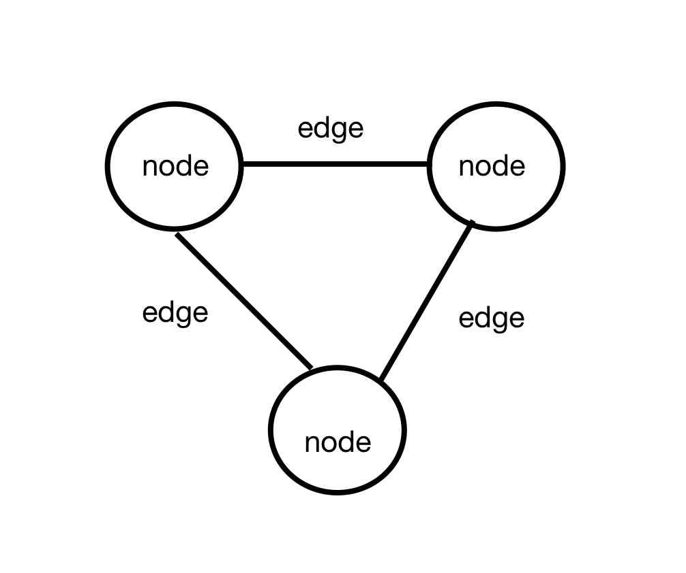

# NENA Text-Fabric Corpus

The NENA Text-Fabric (TF) corpus contains textual transcriptions and linguistic annotations from the research group under Geoffrey Khan at the University of Cambridge.

## Format

One can think of the TF format in two ways. The first is as a *conceptual* model, and the second is as a literal *implementation*. The conceptual model is simply a way of thinking about the text and all its various parts (words, sentences, letters, etc.). The literal implementation is the way this model is actually stored on a computer. 

The *conceptual* model of the TF NENA corpus is as a graph. A graph is simply a way to model relationships between entities. This is done by modeling "entities" as points, or nodes, and relationships as connections, or edges:

In the case of a text graph, entities like letters, words, sentences are modeled as nodes. These entities also have relationships, e.g. a "letter" is inside of a "word." These relationships, and potentiallly even syntactic relationships, are modeled as edges between the nodes. 

